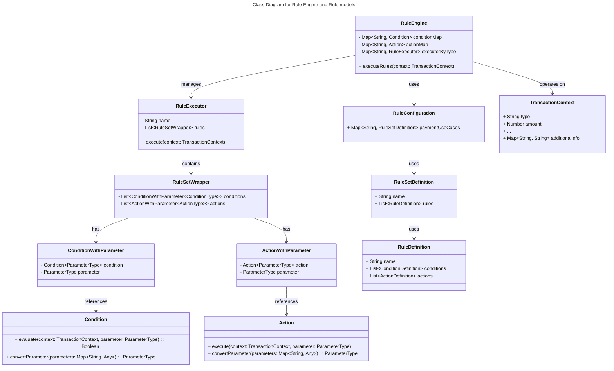
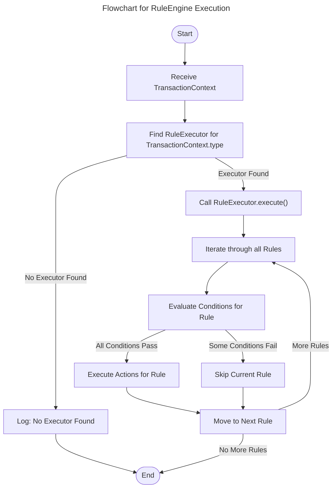
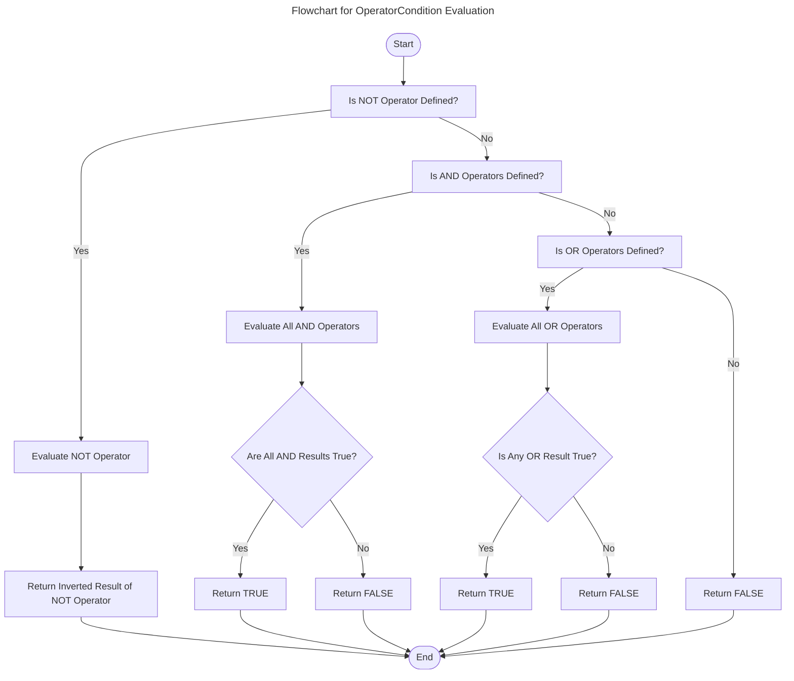

# Rule Engine
Demo project for Rule engine using Spring Boot and Kotlin

### Class Diagram for Rule Engine and Rule models

### Flowchart for RuleEngine Execution

### Flowchart for OperatorCondition Evaluation: support NOT, AND and OR operators

