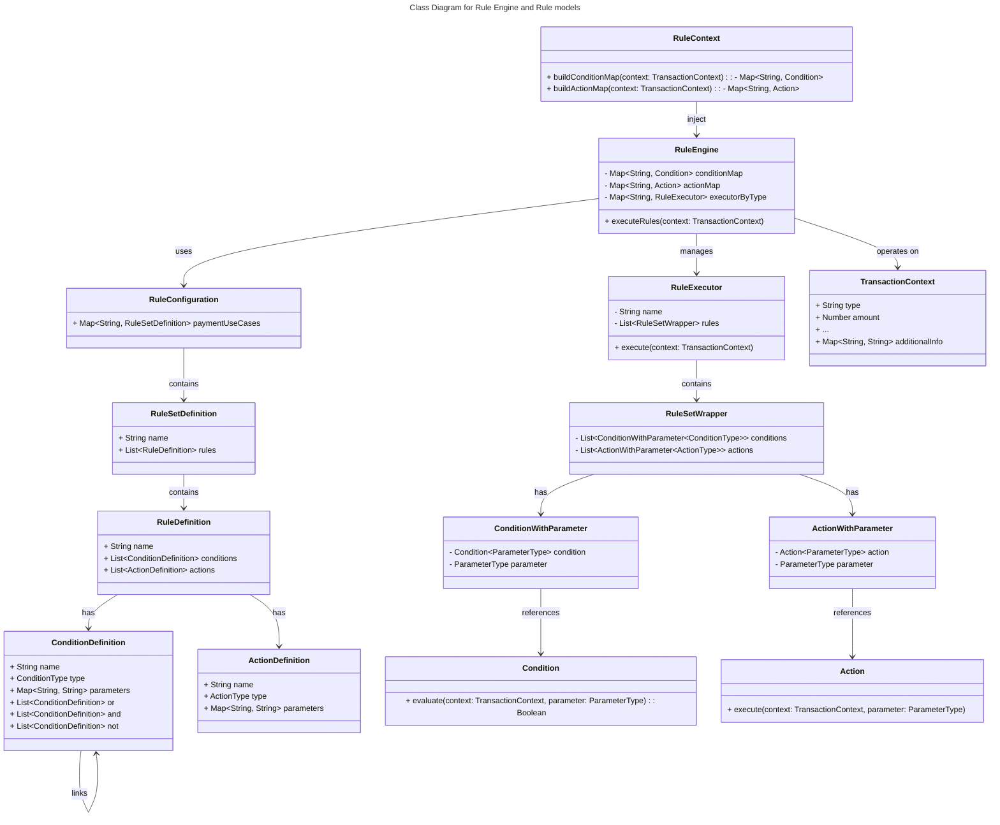
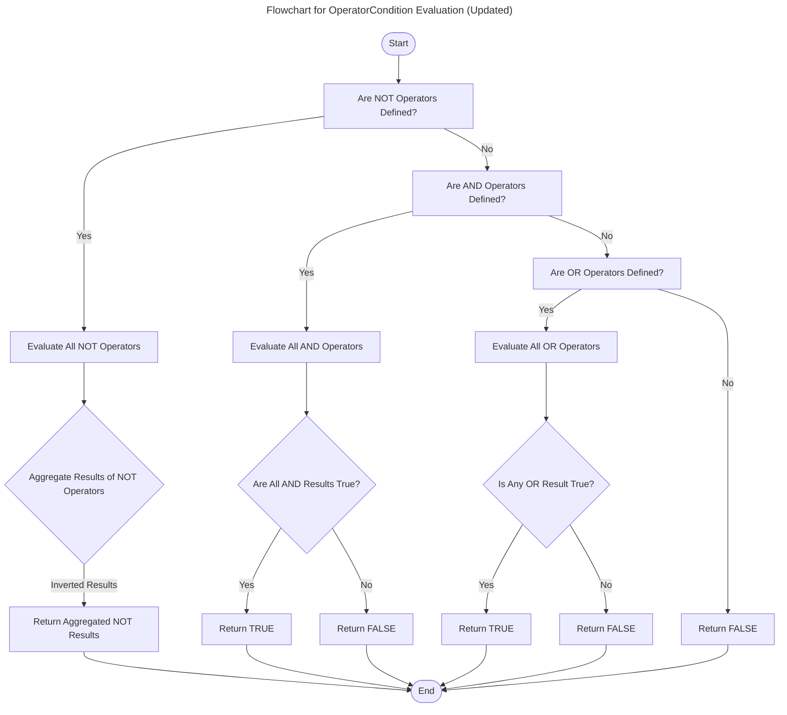

# Rule Engine

## Introduction

The Rule Engine project was developed to address the growing need for flexible and scalable promotion and loyalty configurations in our system. Currently, our promotion logic is hardcoded within the application, making it difficult to introduce new rules without significant development effort. This rigid structure leads to prolonged release cycles and limits the ability to respond quickly to market demands.

To solve these challenges, the Rule Engine provides a configurable and extensible framework where:
- **Flexible Configuration:** Rules can be defined using YAML or JSON without requiring code changes.
- **Extensible:** New conditions and actions can be easily added to the system.
- **User-Friendly:** Designed to be readable and understandable by both technical and non-technical users.
- **Scalable:** Capable of handling multiple use cases with minimal performance overhead.

## How It Works

The Rule Engine allows you to define rules using a declarative approach where conditions and actions are separated. A rule consists of:

- **Condition:** Specifies when the rule should be applied.
- **Action:** Defines the outcomes when the conditions are met.

### Example Use Case
**Scenario:**
- If a customer makes a credit card transaction above 10,000 VND, they will earn 2% reward points.

**YAML Configuration:**
```yaml
rules:
  payment-use-cases:
    regular-card:
      name: Regular Card Purchases
      rules:
        - name: Earn points for regular card purchases over 10k
          conditions:
            - type: EQUALS
              parameters:
                amount: 10000
          actions:
            - type: EARN_POINT_BY_RATE
              parameters:
                rate: 0.02
```

## Getting Started

### Defining a Rule
1. **Identify the Use Case:** Define the business goal you want to achieve.
2. **Define Conditions:** Specify when the rule should apply.
3. **Define Actions:** Specify what actions should be taken when conditions pass.

### Example Steps:
- **Goal:** Provide cashback for amount over 20 million VND.
- **Condition:** If `amount > 20,000,000 VND`.
- **Action:** Apply `2% cashback`.

### Using the Rule Engine
1. **Setup:** Integrate the Rule Engine library into your Spring Boot project.
2. **Load Configuration:** Load rules from a YAML or JSON file.
3. **Execute Rules:** Use the `RuleEngine` class to execute rules against a transaction context.

```kotlin
val ruleEngine = RuleEngine(ruleConfiguration)
ruleEngine.executeRules(transactionContext)
```

## Class Diagram for Rule Engine and Rule models


### Flowchart for RuleEngine Execution


### Flowchart for OperatorCondition Evaluation: support NOT, AND and OR operators



This Rule Engine empowers both developers and business teams to manage and extend promotional logic with minimal technical intervention, improving system flexibility and reducing time-to-market for new features.