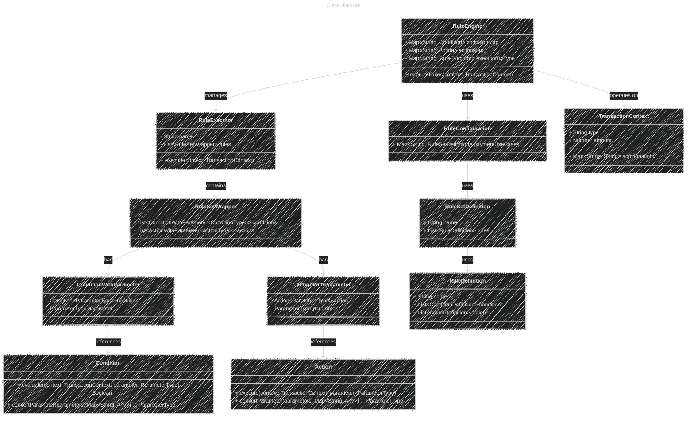

# Rule Engine
Demo project for Rule engine using Spring Boot and Kotlin

### Diagram

```mermaid
---
title: Class diagram
config:
  theme: dark
  look: handDrawn
---
classDiagram
    class RuleEngine {
        - Map~String, Condition~ conditionMap
        - Map~String, Action~ actionMap
        - Map~String, RuleExecutor~ executorByType
        + executeRules(context: TransactionContext)
    }

    class RuleExecutor {
        - String name
        - List~RuleSetWrapper~ rules
        + execute(context: TransactionContext)
    }

    class RuleSetWrapper {
        - List~ConditionWithParameter~ConditionType~~ conditions
        - List~ActionWithParameter~ActionType~~ actions
    }

    class ConditionWithParameter {
        - Condition~ParameterType~ condition
        - ParameterType parameter
    }

    class ActionWithParameter {
        - Action~ParameterType~ action
        - ParameterType parameter
    }

    class RuleConfiguration {
        + Map~String, RuleSetDefinition~ paymentUseCases
    }


    class RuleSetDefinition {
        + String name
        + List~RuleDefinition~ rules
    }
    class RuleDefinition {
        + String name
        + List~ConditionDefinition~ conditions
        + List~ActionDefinition~ actions
    }

    class TransactionContext {
        + String type
        + Number amount
        + ...
        + Map~String, String~ additionalInfo
    }

    class Condition {
        + evaluate(context: TransactionContext, parameter: ParameterType): Boolean
        + convertParameter(parameters: Map~String, Any~): ParameterType
    }

    class Action {
        + execute(context: TransactionContext, parameter: ParameterType)
        + convertParameter(parameters: Map~String, Any~): ParameterType
    }

    RuleEngine --> RuleExecutor : manages
    RuleExecutor --> RuleSetWrapper : contains
    RuleSetWrapper --> ConditionWithParameter : has
    RuleSetWrapper --> ActionWithParameter : has
    RuleEngine --> RuleConfiguration : uses
    RuleConfiguration --> RuleSetDefinition : uses
    RuleSetDefinition --> RuleDefinition : uses
    ConditionWithParameter --> Condition : references
    ActionWithParameter --> Action : references
    RuleEngine --> TransactionContext : operates on
```
